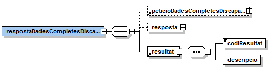

# Via Oberta - Títol de Família Nombrosa
Document d’integració del servei.

Podreu trobar els XSD's del servei en aquest repositori sota el directori [/schema](https://github.com/ConsorciAOC/VO-TFN/tree/main/TFN-schemes).

## Control del document

### Informació general

| **Títol:** | Via Oberta – Títol de Família Nombrosa. Document d’integració del servei|
| --- | --- |
| **Creat per:** | Àrea de Tecnologia - Projectes |
| **A revisar per:** | Àrea de Tecnologia - Suport |
| **A aprovar per:** | Àrea de Tecnologia - Suport|
| **Llista de distribució:** | |
| **Nom del document:** | DI - Via Oberta - TFN.doc |

### Històric de revisions

| **Versió** | **Data** | **Autor** | **Comentaris** |
| --- | --- | --- | --- |
| V1.0 | 12/11/2012 | Roger Noguera i Arnau| Creació del document (nou servei) |
| V1.1 | 21/03/2014 | Áurea Alcaide Izquierdo | Actualització valor “NIF” del camp tipus de document.|
| V2.0 | 24/10/2018 | Roger Noguera i Arnau | Retorn de la data de inici de vigència en les consultes de dades complertes|
| V2.1 | 07/03/2018 | Roger Noguera i Arnau | Incorporació d’un nou estat “Transitori”.|
| V2.2 | 05/03/2020 | Roger Noguera i Arnau | Discontinuació del frontal FTP. Transferència de fitxer de titulars per MTOM. |

### Índex

- [1. Introducció](#1)
- [2. Transmissions de dades disponibles](#2)
- [3. Missatgeria dels serveis](#3)
   * [3.1. Consulta de vigència (TFN_VIGENCIA)](#3.1)
		* [3.1.1 Petició – dades específiques](#3.1.1)
		* [3.1.2 Resposta - dades específiques](#3.1.2)
   * [3.2. Consulta de dades d'un títol (TFN_DADESCOMPLETES)](#3.2)
		* [3.2.1 Petició – dades específiques](#3.2.1)
		* [3.2.2 Resposta - dades específiques](#3.2.2)
   * [3.3 Consulta de dades d'un títol i nombres de discapacitats (TFN_DADESCOMPLETES_DIS)](#3.3)
   		* [3.3.1 Petició – dades específiques](#3.3.1)
   		* [3.3.2 Resposta – dades específiques](#3.3.2)
   * [3.4 Consulta de dades d'un títol per lots (TFN_DADESCOMPLETES_MASSIU)](#3.3)
   		* [3.3.1 Petició – dades específiques](#3.3.1)
   		* [3.3.2 Resposta – dades específiques](#3.3.2)
   * [3.5 Consulta de dades d'un títol i nombre de discapacitats per lots (TFN_DADESCOMPLETES_DIS_MASSIU))](#3.5)
   		* [3.5.1 Petició - dades genèriques](#3.5.1)
   		* [3.5.2 Resposta](#3.5.2)		
- [4. Joc de proves](#4)

## 1 Introducció 
Aquest document detalla la missatgeria associada al servei de Títol de Família Nombrosa (TFN en endavant).

 Per poder realitzar la integració cal conèixer prèviament la següent documentació: 

- [Document de Missatgeria Genèrica de la PCI del Consorci AOC.][PCI]

[PCI]:https://github.com/ConsorciAOC/PCI

## 2 Transmissions de dades disponibles 

Les dades disponibles a través del servei són les que es presenten a continuació

- **EMISSOR**: Secretaria de Polítiques Familiars i Drets de Ciutadania

| **PRODUCTE** | **MODALITAT** | **DESCRIPCIO** |
| --- | --- | --- |
| **TFN**| [TFN_VIGENCIA](#3.1) | Consulta de vigència en una data.|
| **TFN**| [TFN_DADESCOMPLETES](#3.2) | Consulta de dades completes del títol.  |
| **TFN**| [TFN_DADESCOMPLETES_DIS](#3.3) | Consulta de dades completes del títol i nombre de discapacitats de la família.|
| **TFN**| [TFN_DADESCOMPLETES_MASSIU](#3.4) | Consulta de dades completes del títol (lot).|
| **TFN**| [TFN_DADESCOMPLETES_DIS_MASSIU](#3.5) | Consulta de dades completes del títol i nombre de discapacitats de la família (lot).
|
Totes les consultes del producte –a excepció de les consultes per lot– tenen disponible la versió imprimible del resultat de la consulta en format PDF. Per més detalls adreceu-vos a l’apartat Extensions de missatgeria del document de missatgeria genèrica.

>:warning: L’emissor final de les dades atura el servei en la franja de 3:00 a 5:00 de la matinada per manteniment.

## 3 Missatgeria dels serveis
A continuació es detalla la missatgeria corresponent al bloc de dades específiques de les modalitats de consum del producte TFN.

### 3.1 Consulta de vigència - (TFN_VIGENCIA) 
La consulta de la vigència d’un títol proporciona informació sobre si el títol existeix i és vigent, si
existeix i no és vigent o si el títol està en tràmit.

### 3.1.1 Petició – dades específiques 

| *Element*| *Descripció* | 
| --- | --- |
|/peticioConsultaVigencia/identificadorTitular |Identificador del titular en cas de consulta per dades identificatives.|
|/peticioConsultaVigencia/dadesTitular|Identificador del titular en cas de consulta per cognom i data de naixement.|
|/peticioConsultaVigencia/identificadorTitular/tipusDocumentacio|Tipus de document identificador: <ul><li>NIF</li><li>NIE</li><li>Passaport</li></ul> 
|/peticioConsultaVigencia/identificadorTitular/documentacio|Document identificador|
|/peticioConsultaVigencia/dadesTitular/primerCognom|Primer cognom (s’obvien majúscules / minúscules i accents).|
|/peticioConsultaVigencia/dadesTitular/dataNaixement|Data de naixement del titular (DDMMAAAA).|
|/peticioConsultaVigencia/numeroTitol|Número de títol.|
|/peticioConsultaVigencia/categoria |Categoria|
|/peticioConsultaVigencia/data |Data de comprovació de vigència(DDMMAAAA). L'emissor final no suporta consultes de dates anteriors a l'1 de gener a l'any anterior a l'actual.|

### 3.1.2 Resposta – dades específiques 
De l’schema associat a la resposta especifica, el servei informa les dades que es detallen a continuació.

| *Element*| *Descripció* | 
| --- | --- |
|/respostaConsultaVigencia/peticioConsultaVigencia |Bloc de dades corresponent a la petició que genera la resposta.|
|/respostaConsultaVigencia/resposta/indicadorVigencia|Indicador de vigència del títol:<ul><li>Vigent: <i>Si</i></li><li>No vigent <i>NO_VIGENT</i></li><li>Transitori: <i>TRANSITORI</i></li><li>No trobat: <i>NO_TROBAT</i></li></ul> 
|/respostaConsultaVigencia/resposta/codiAvis|Si el títol localitzat no és vigent però està en tràmit s’informa aquest element indicant la data de sol·licitud de tramitació del títol.|
|/respostaConsultaVigencia/resultat/codiResultat |<ul><li>0:<i>Operació realitzada correctament.</i></li><li>0:<i>Error realitzant la consulta.</i></li><li>2:<i>No s'ha trobat títol amb les dades especificades.</i></li></ul> |
|/respostaConsultaVigencia/resultat/descripcio|Descripció del resultat|

## 3.2  Consulta de dades d’un títol (TFN_DADESCOMPLETES)  
La consulta de dades d’un títol proporciona informació del títol incloent els camps adreça a partir de
l’identificador del titular o d’algun dels seus fills.

  Si el títol consta amb més d’un tram de vigència es retornen les dades associades al tram de vigència
més recent.

### 3.2.1 Petició – dades específique 

| *Element*| *Descripció* | 
| --- | --- |
|/peticioDadesCompletes/identificadorTitular|Identificador del titular en cas de consulta per dades identificatives.|
|/peticioDadesCompletes/dadesTitular |Identificador del titular en cas de consulta per cognom i data de naixement.|
|/peticioDadesCompletes/identificadorTitular/tipusDocumentacio|Tipus de document identificador: <ul><li>NIF</li><li>NIE</li><li>Passaport</li></ul>|
|/peticioDadesCompletes/identificadorTitular/documentacio|Document identificador|
|/peticioDadesCompletes/dadesTitular/primerCognom|Primer cognom (s’obvien majúscules / minúscules i accents).|
|/peticioDadesCompletes/dadesTitular/dataNaixement|Data de naixement del titular (DDMMAAAA).|

### 3.2.2 Resposta – dades específiques 
| *Element*| *Descripció* | 
| --- | --- |
|/respostaDadesCompletes/peticioDadesCompletes |Bloc de dades corresponent a la petició que genera la resposta.|
|/respostaDadesCompletes/resposta | Bloc de dades amb les dades del títol. Vegeu l’apartat 3.2.2.1 per més detalls|
|/respostaDadesCompletes/resultat/codiResultat|<ul><li>0:<i>Operació realitzada correctament.</i></li><li>0:<i>Error realitzant la consulta.</i></li><li>2:<i>No s'ha trobat títol amb les dades especificades.</i></li></ul>|
|/respostaDadesCompletes/resultat/descripcio |Descripció del resultat.|

#### 3.2.2.1 Dades del títol 

| *Element*| *Descripció* | 
| --- | --- |
|//resposta/numeroTitol|Número de títol.|
|//resposta/nom | Nom del titular.|
|//resposta/primerCognom |Primer cognom del titular|
|//resposta/segonCognom |Segon cognom del titular.|
|//resposta/numeroFills |Número de fills.|
|//resposta/categoria |Categoria del títol.|
|//resposta/estat|Estat del títol (vigent, no vigent, en tràmit, transitori).|
|//resposta/tipusVia|Tipus de via.|
|////resposta/nomVia|Nom de la via|
|//resposta/bloc|Bloc.|
|//resposta/numero|Número|
|//resposta/pis |Pis.|
|//resposta/escala |Escala.|
|//resposta/porta |Porta.|
|//resposta/codiPostal|Codi postal.|
|//resposta/localitat |Localitat.|
|//resposta/provincia|Província.|
|//resposta/dataIniciVigencia |Data d’inici de vigència del títol|
|//resposta/dataCaducitat|Data de caducitat del títol.|
|//resposta/tipus |Relació del titular consultat en el títol.|
|//resposta/numDiscapacitats|Informat únicament en modalitat TFN_DADESCOMPLETES_DIS. Número de discapacitats.|

## Consulta de dades d’un títol i nombre de discapacitats(TFN_DADESCOMPLETES_DIS) 
La consulta de dades d’un títol proporciona informació del títol incloent els camps adreça a partir de l’identificador del titular o d’algun dels seus fills.

 Si el títol consta amb més d’un tram de vigència es retornen les dades associades al tram de vigència
més recent.

### 3.3.1 Petició – dades específiques 

| *Element*| *Descripció* | 
| --- | --- |
|/peticioDadesCompletesDiscapacitats/identificadorTitular/tipusDocumentacio|Tipus de document identificador: <ul><li>NIF</li><li>NIE</li><li>Passaport</li></ul>|
|/peticioDadesCompletesDiscapacitats/identificadorTitular/documentacio| Document identificador|

### 3.3.2 Resposta – dades específiques 

| *Element*| *Descripció* | 
| --- | --- |
|/respostaDadesCompletesDiscapacitats/peticioDadesCompletesDiscapacitats|Bloc de dades corresponent a la peticióque genera la resposta.|
|/respostaDadesCompletesDiscapacitats/resposta| a Bloc de dades amb les dades del títol. Vegeu l’apartat 3.2.2.1 per més detalls.|
|/respostaDadesCompletesDiscapacitats/resultat/codiResultat|<ul><li>0: <i>Operació realitzada correctament.</i></li><li>1: <i>Error realitzant la consulta.</i></li><li>2: <i>No s'ha trobat títol amb les dades especificades.</i></li></ul>|
|/respostaDadesCompletesDiscapacitats/resultat/descripcio|Descripció del resultat.|

### 3.4 Consulta de dades d’un títol per lots (TFN_DADESCOMPLETES_MASSIU) 
Consulta de dades de títols per lots a partir de documents identificadors.

 Per cada identificador retorna un fitxer amb les dades del títol corresponent al titular del tram de
vigència més recent.

### 3.4.1 Petició – dades genèriques 

| *Element*| *Descripció* | 
| --- | --- |
|//Ficheros/Fichero/Contenido |Fitxer amb els identificadors dels titulars dels quals es vol obtenir les dades dels títols (un per línia) fins a un màxim de 500.000 titulars.   Per a la transferència d'aquest fitxer cal seguir l'estàndard MTOM (referència XOP al contingut del fitxer)|

### 3.4.2 Resposta 

#### 3.4.2.1 Dades específiques 

| *Element*| *Descripció* | 
| --- | --- |
|/respostaDadesCompletesMassiu/resposta/efectius|Si la petició es processa correctament, número de titulars localitzats pels quals es retornen dades.|
|/respostaDadesCompletesMassiu/resposta/resultat| Fitxer ZIP amb el resultat codificat en base 64.|
|/respostaDadesCompletesMassiu/resultat/codiResultat |<ul><li>0: <i>Operació realitzada correctament.</i></li><li>1: <i>Error realitzant la consulta.</i></li></ul>|
|/respostaDadesCompletesMassiu/resultat/descripcio|Descripció del resultat.|

El fitxer de resposta contindrà les respostes separades per un salt de línia amb el següent format:
| *Descripciò*| *Longitud* | 
| --- | --- |
|Número de títol|25|
|Identificador del titular|15|
|Nom del titular|20|
|Primer cognom del titular|25|
|Segon cognom del titular|25|
|Número de fills|2|
|Categoria|1|
|Data de caducitat|10|
|Estat (VIGENT, NO_VIGENT, EN_TRAMIT O TRANSITORI)|10|
|Adreça (formada pels camps nom_via, bloc, numero, pis, escala i porta)|70|
|Codi postal|5|
|Codi població|5|
|Nom població|45|
|Codi llogaret (2 posicions sempre en blanc)|2|
|Tipus persona (1 posició, amb valor T o C)|2|

>El tipus de persona T indica que el membre identificat en el fitxer d'entrada per aquell títol és el titular i
C que el membre identificat en el fitxer d'entrada per aquell títol és el co-titular. No obstant, en el cas
de TFN sempre s'informarà T ja que no hi ha co-titulars en les famílies monoparentals.

## 3.5 Consulta de dades d’un títol i nombre de discapacitats per lots (TFN_DADESCOMPLETES_DIS_MASSIU) 

Consulta de dades de títols i número de discapacitats per lots a partir de documents identificadors.

 Per cada identificador retorna un fitxer amb les dades del títol corresponent al titular del tram de
vigència més recent.

### 3.5.1 Petició – dades genèriques 
| *Element*| *Descripció* | 
| --- | --- |
|//Ficheros/Fichero/Contenido |Fitxer amb els identificadors dels titulars dels quals es vol obtenir les dades dels títols (un per línia) fins a un màxim de 500.000 titulars.   Per a la transferència d'aquest fitxer cal seguir l'estàndard MTOM (referència XOP al contingut del fitxer).|

### 3.5.2 Resposta

#### 3.5.2.1 Dades específiques 

| *Element*| *Descripció* | 
| --- | --- |
|/respostaDadesCompletesDiscapacitatsMassiu/resposta/efectius|Si la petició es processa correctament, número de línies del fitxer resultat.|
|/respostaDadesCompletesDiscapacitatsMassiu/resposta/resultat|Fitxer ZIP amb el resultat codificat en base 64.|
|/respostaDadesCompletesDiscapacitatsMassiu/resultat/codiResultat|<ul><li>0: <i>Operació realitzada correctament.</i></li><li>1: <i>Error realitzant la consulta.</i></li></ul>|
|/respostaDadesCompletesDiscapacitatsMassiu/resultat/descripcio|Descripció del resultat|

El fitxer de dades amb els titulars processats contindrà les respostes separades per un salt de línia
amb el següent format

| *Descripciò*| *Longitud* | 
| --- | --- |
|Número de títol|25|
|Identificador del titular|15|
|Nom del titular|20|
|Primer cognom del titular|25|
|Segon cognom del titular|25|
|Número de fills|2|
|Categoria|1|
|Data de caducitat|10|
|Estat (VIGENT, NO_VIGENT, EN_TRAMIT O TRANSITORI)|10|
|Adreça (formada pels camps nom_via, bloc, numero, pis, escala i porta)|70|
|Codi postal|5|
|Codi població|5|
|Nom població|45|
|Codi llogaret (2 posicions sempre en blanc)|2|
|Número de persones amb discapacitat |2|
|Tipus persona (1 posició, amb valor T o C)|2|

>El tipus de persona T indica que el membre identificat en el fitxer d'entrada per aquell títol és el titular i
C que el membre identificat en el fitxer d'entrada per aquell títol és el co-titular. No obstant, en el cas
de TFN sempre s'informarà T ja que no hi ha co-titulars en les famílies monoparentals.

## 4 Joc de proves 

L&#39;emissor final publica els següent [joc de proves a l&#39;entorn de pre-producció][proves] 

[proves]: http://transversals.ctti.intranet.gencat.cat/sol-pica-iop-gene/
 En cas de tindre problemes per accedir als jocs de proves, si us plau, obre un tiquet a través del [formulari][form]

[form]:https://suport.aoc.cat/hc/ca/requests/new
